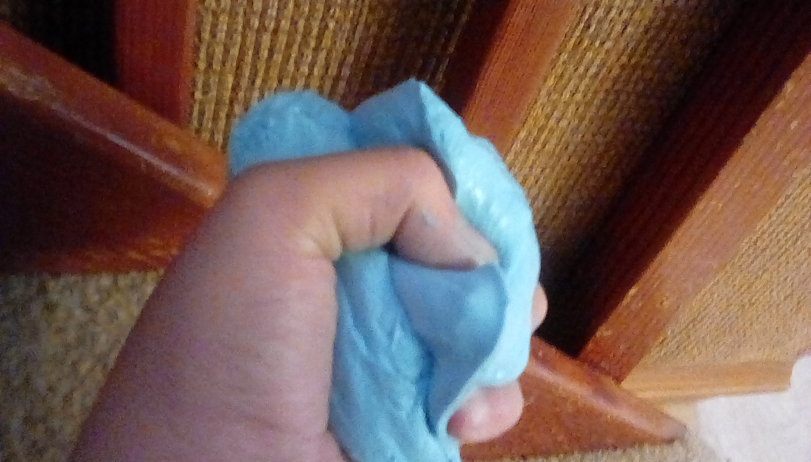

# aphroditie3.github.io
My website has cooking recipes, and fun activities for the young ones 

# Rock Candy
### here's what you need
2 cups of water, 4 cups of suger, food coloring
### how to make it
1. pour water into a large pot
1. add sugar and stir until the sugar stops dissolving
1. place the pot onto the stove at meadium-high heat
1. stir so the rest of the sugar dissalves
1. remove pot from heat and let it cool
1. pour the mixture into a plastic contaner
1. in 10 days the bottom will be covered in rock candy
1. turn the plastic container upside down and let it drain into the sink for one hour
1. break the rock candy and place them onto several layers of papertowels to dry
1. once there dry dig into your hard earned rock candy

# Clear Slime

you can use regular glue too
### here's what you need
1 bottle clear elmores glue,food coloring (optional), glitter(optional), borax, water
### how to make it
1. pour the glue into a large bowl and a some water the amount of water you use is up to you
1. in a serate bowl fill it with water and mix in the borax until it stops dissolving
1. add the food coloring and glitter of your choice to the glue and water solution and mix it together
1. add 1 teaspoon of the borax solution and mix
1. if its to sticky then add some more borax until you like it
1. now enjoy your new slime you can even prank your friends with it

# Fake Snot
### here's what you need
3 Tbsp gelatine, 6 Tbsp of corn syrup, a few drops of food colouring of your choice, and 3 Tbsp hot water
### how to make it
1. mix the gelatin with the water
1. add food coloring
1. let it cool down to room tempature
1. add your corn syrup and mix with a fork until you get long strands of fake snot
1. and enjoy your fake snot to gross out your friends and family

# Cooking in the Sun
### here's what you need
a large bowl, tin foil, poster tack, a toothpick, 1 marshmallow, plastic wrap, a pile of stones
### how to make it
1. line your bowl with tin foil and press your poster tack into the center of the bowl
1. put a marshmallow on the end of your toothpick 
1. press the other end of the toothpick into the poster tack and cover the top with plastic wrap
1. put the bowl outside in a sunny place and use stones to hold it up in the position of the sun
1. leave it out there for 15 minutes the marshmallow should start to melt 
1. if the marshmallow has not begun to melt then wait another 15 minutes and check again and enjoy

# Gloop
### here,s what you need
2 cups cornflour, 1 cup water, 2 drops food coloring of your choice
### how to make it
1. add the cornflour, water, and food coloring into i big bowl
1. mix it all together and slap it it should resist you 
1. now role it into a ball and stop it should drip through your fingers

# Salad Dressing
### here's what you need
3 Tbsp viniger, 3 Tbsp olive oil
### how to make it
1. pour the olive oil and viniger into a jar
1. mix and add to your salad

# Meringues
### here's what you need
1 egg white, 1/4 cup of suger\
### how to make it
1. cut baking parchment to fit your baking tray and preheat the oven 225'f
1. crack your egg and seperate the egg yolk from the egg white and pour the egg white into a bowl
1. beat the egg white until it becomes a thick foam and makes peaks when you lift it
1. add your suger to the egg white and mix it in a spoonful at a time
1. pour a tsp of the mixture onto the parchment until the pan is full while leaving gaps
1. bake for 45 minutes then turn off the oven and let it sit in the oven for 15 more minutes
1. then take them out to cool then serve to your friends and family
